# 2016-DLRW-Podolski
Individual student repository for the 2016 Summer semester course Deep Learning in the Real World.

## Multiclass logistic regression
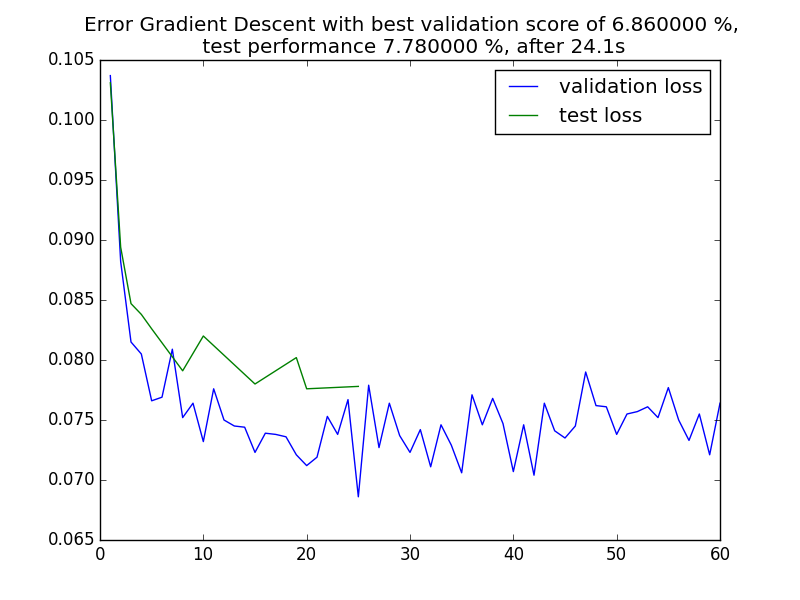
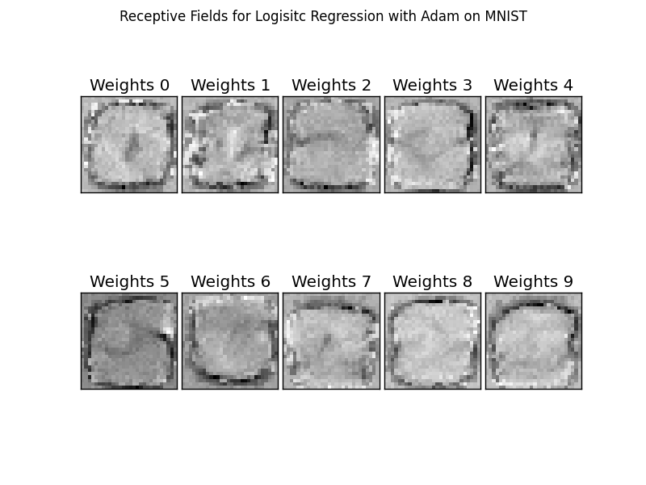
## Two-layer neural network
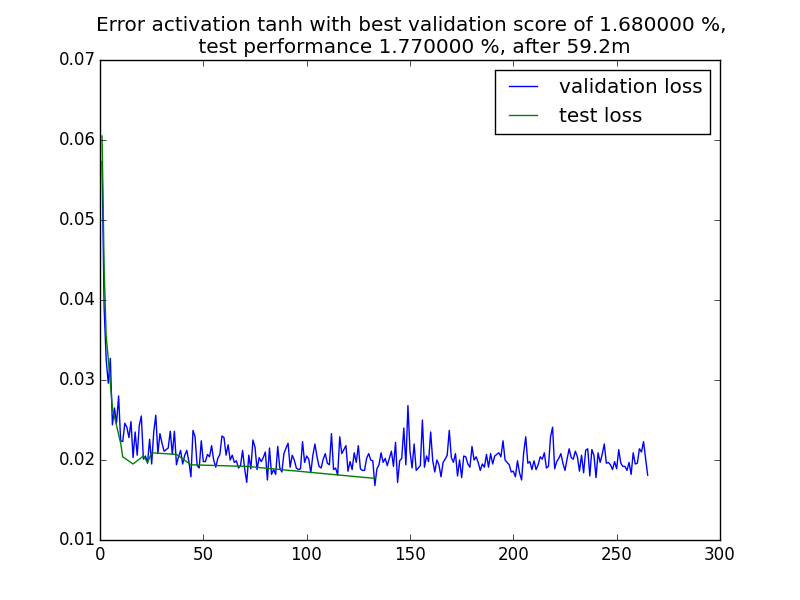
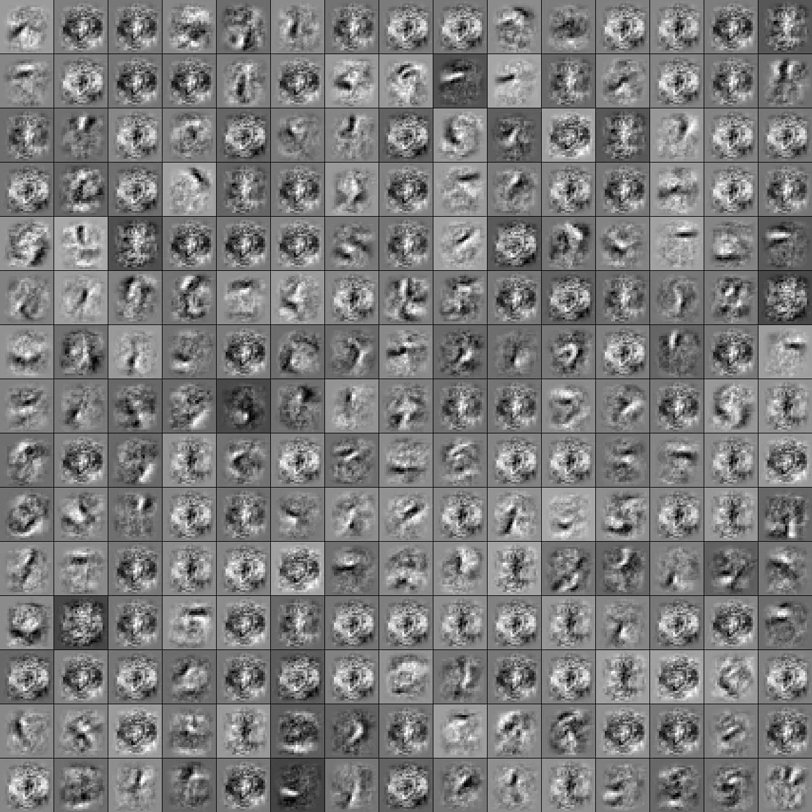
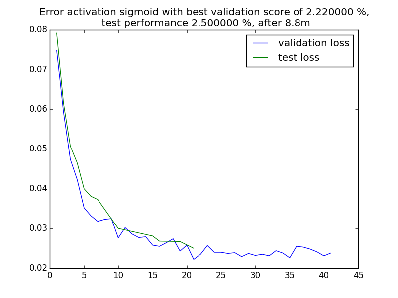
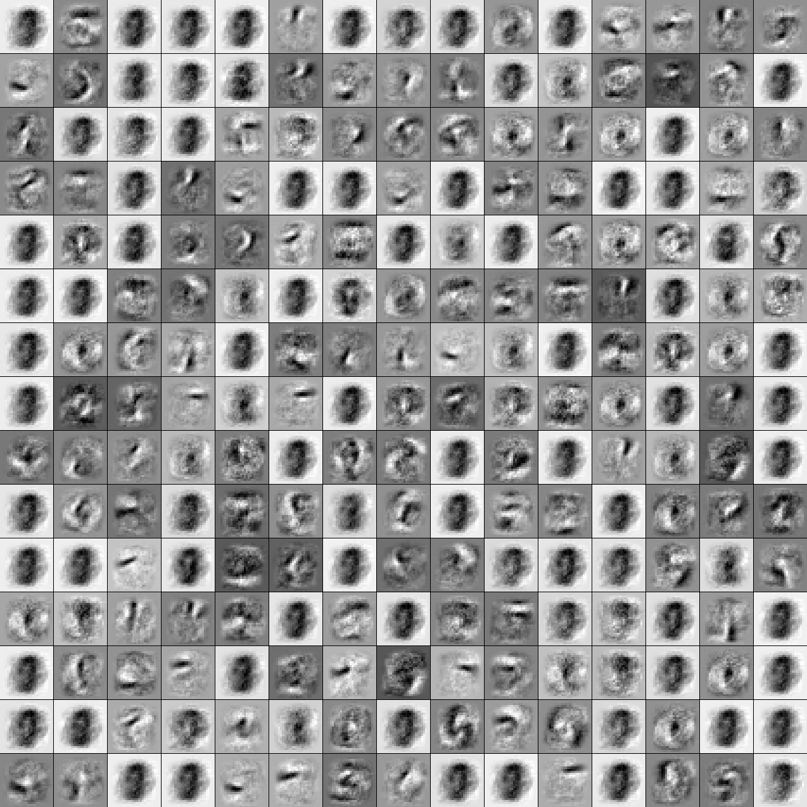
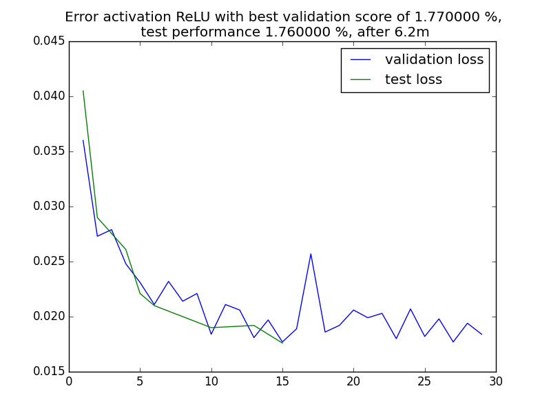
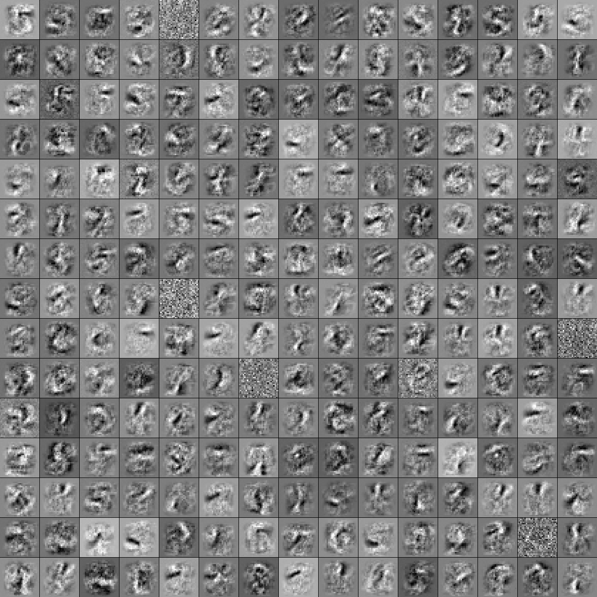
## PCA and sparse autoencoder
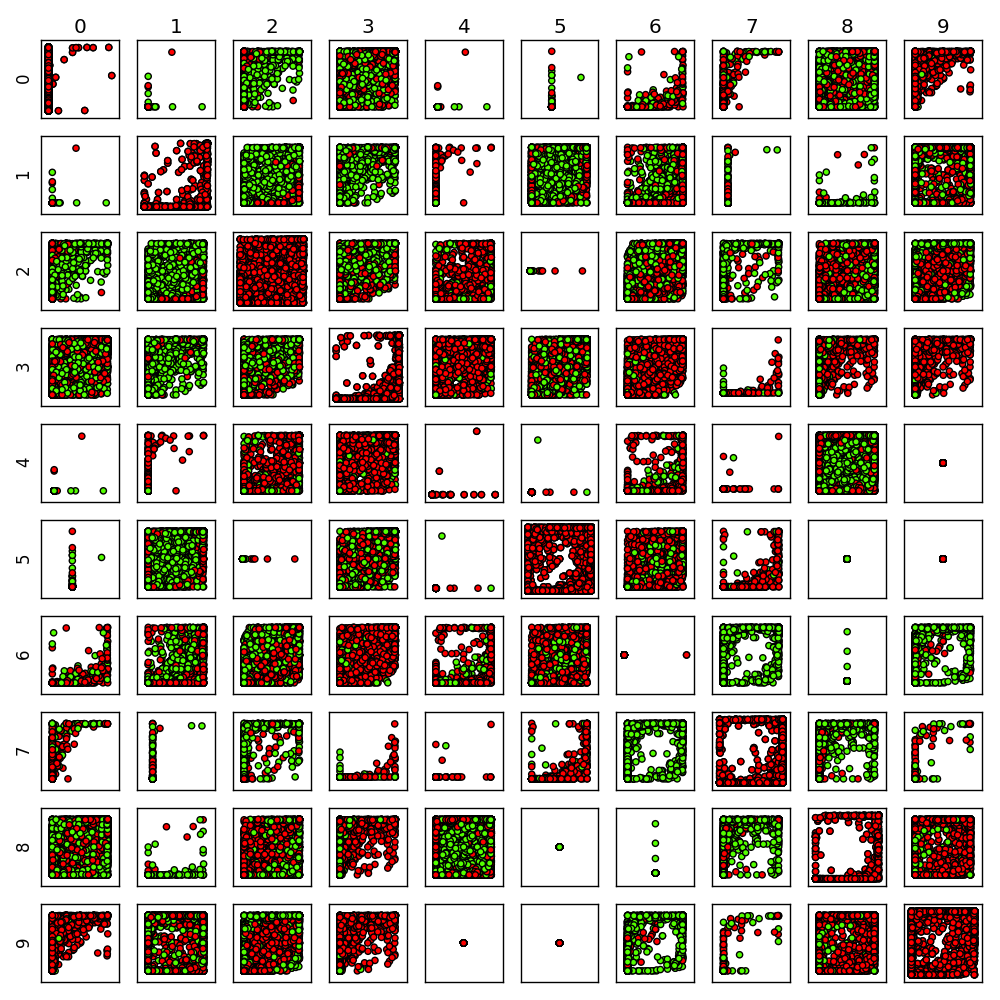

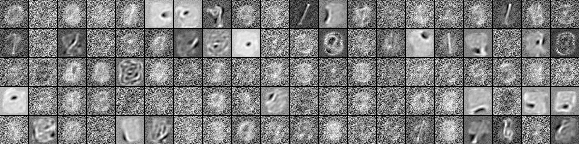

## t-SNE
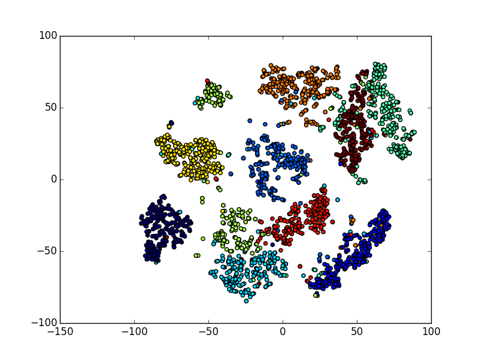
## k-Mean
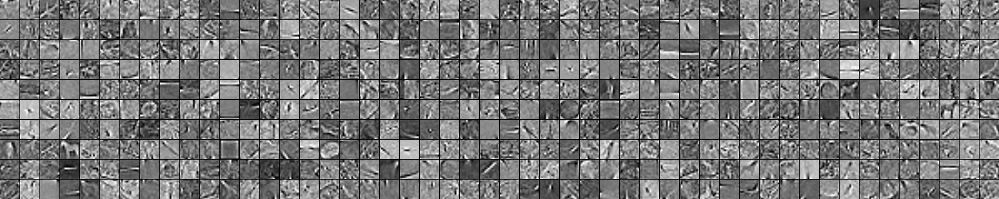
